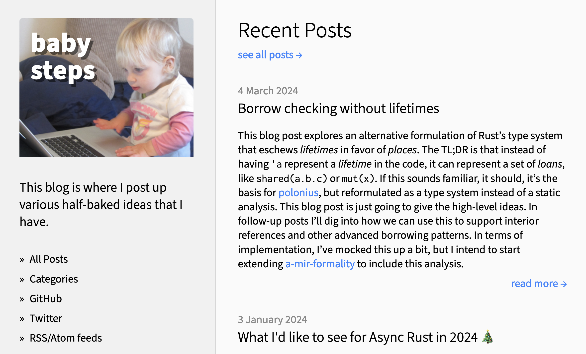
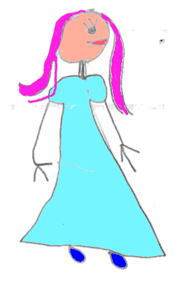
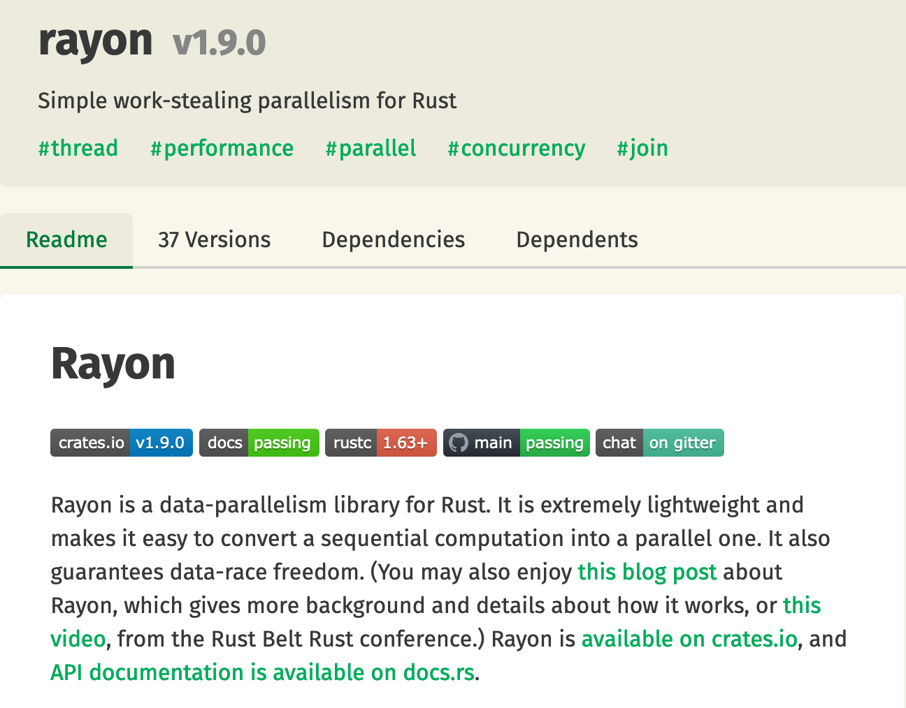

class: center
name: title
count: false

# Rust Past and Future

.p60[]

View slides at `https://nikomatsakis.github.io/rustleeds-25/`.

.me[.grey[*by* **Nicholas Matsakis**]]
.footnote[Press `P` to read the transcript.]

---

# I wear many hats

???

So, yeah, who am I? I've been involved in Rust a long time, and along the 
way, I've wound up playing a number of different roles.

---

# Rust language designer¹

.footnote[¹ Shoutout to Tyler Mandry, Rust language design team co-lead, and Josh Triplett, fellow lang team member, both here today.]

???

To start, I work on the design of the language itself. I'm co-lead of the Rust language design team, along with Tyler Mandry -- here in the audience!. Together with the rest of the lang team like Josh Triplett (here in the audience!) we decide what features we are going to add to Rust and which we will not.

---

# Senior Principal Engineer @ Amazon 

???

I'm also a Senior Principal Engineer at Amazon. In that capacity I get to work with the teams using Rust at Amazon -- and there are a lot! How many of you build something that uses S3? Yeah, you're using Rust.

The great thing about this role is that I get to go and talk very deeply to those Rust teams, learn what's working, what's not, and then bring that back to the Rust community, where it gets combined with what other users are experiencing, and used to make Rust better for everyone.

---

# Bursty [blogger](https://smallcultfollowing.com/babysteps)



???

I also maintain a blog. I have for a long time, I love it. I say I'm bursty because sometimes I write 3 posts in a day, other times, like recently, it can be months. It just depends on what I've got going on.

---

# What hat am I wearing today?

None of them.

All of them.

???

So what hat am I wearing today? In one sense, none of them. I'm hearing giving you my personal opinion. I'm going to tell you things that I believe but which don't represent team consensus and certainly not Amazon's opinion.

On the other hand, all those roles inform that opinion, and I don't really believe you can fully "take off" a hat like that.

---

# Rust's sweet spot

### Foundational software

.footnote[[Read more](https://smallcultfollowing.com/babysteps/blog/2025/03/10/rust-2025-intro/)]

Emphasis on

* Reliability
* Performance
* Productivity

???

* Software that underlies everything else
* Everything extra important

---

# Lowering the barrier to entry

"Systems programming...not just for wizards anymore"

???

---

# Iterators: performant, composable abstractions

| | What makes Rust *Rusty?* | |
| :-- | :-- | :-- |
| ⚙️ | Reliable | |
| .mark[🏎️] | .mark[Performant, composable abstractions] | |
| 🔧 | Low-level control and transparency | |
| 🌟 | Extensible and productive | |
| 🤸🏾 | Accessible and supportive | |

???

OK, let's see how these work in action. I'm going to illustrate by taking
a close look at *iterators*, which I think are a great example of a performant,
composable abstraction.

---

# Let's tell a story



.footnote[
    Artistic credit goes to my daughter.
]

???

To better understand the value prop, we're going to tell a story, and it starts with Barbara. She's a Rust programmer. She's also a drawing that my daughter made some years back and that I kind of love to death.

---
name: thumbnails

# Let's tell a story

```rust
fn make_thumbnails(images: &[Image]) -> Vec<Image> {
    images
        .iter()
        .map(|image| image.make_thumbnail())
        .collect()
}
```

.abspos.left30.top350[]

???

Barbara is working on an app and she needs to take a list of images
and create thumbnails for them. So, she sits down and bangs out this code
using iterators. You've probably written code like it before.
It's a great example of composability, how the iterator APIs let you create
combine operations like map, filter, to do non-trivial things.

---

name: make-thumbnails-at-top

```rust
fn make_thumbnails(images: &[Image]) -> Vec<Image> {
    images
        .iter()
        .map(|image| image.make_thumbnail())
        .collect()
}
```

---
template: make-thumbnails-at-top

???

This is the code Barbara writes. But what is the code that *runs*?
This is where Rust takes advantage of a really cool trick that we learned
from C++, which is called *zero-cost abstractions*. 

---

template: make-thumbnails-at-top
name: with-translated-code

```rust
fn make_thumbnails(images: &[Image]) -> Vec<Image> {
    let mut i = 0;
    let l = images.len();
    let mut output = Vec::with_capacity(l);
    while i < l {
        output.push(images[i].make_thumbnail());
        i += 1;
    }
    output
}
```

---
template: with-translated-code

???

The idea is that you can write this high-level code but, once the compiler 
is finished optimizing, what you get out is going to be equivalent to 
the low-level code you would've written by hand.
So something like this.  In fact, this code includes a few optimizations 
you might not have thought of.

---

template: with-translated-code

.arrow.abspos.left430.top300.rotSW[]

???

For example, when we create the new array, we know how big it should be, so we can allocate it to just the right size.

---

template: with-translated-code

.arrow.abspos.left340.top420.rotNW[]

???

And when you access an element from an array, that normally requires 
bounds checks.

---

```rust
fn make_thumbnails(images: &[Image]) -> Vec<Image> {
    images
        .iter()
        .map(|image| image.make_thumbnail())
        .collect()
}
```

```rust
fn make_thumbnails(images: &[Image]) -> Vec<Image> {
    let mut i = 0;
    let l = images.len();
    let mut output = Vec::with_capacity(l);
    while i < l {
        output.push(unsafe { images.get_unchecked(i).make_thumbnail() });
        i += 1;
    }
    output
}
```

.arrow.abspos.left500.top420.rotNW[]

???

But since we're using iterators, we know the bounds are in-scope,
so we can just skip them.  So you get something like this.

--

.abspos.left650.top450.fliplr[]

.abspos.left300.top550[
.speech-bubble.barbara.right[
Which would *you* rather write?
]]

???

And this is Rust's promise: high-level things like iterators and closures
don't come with hidden costs. Those costs can become a kind of abstraction
tax that means that when you really need perforance you have to write
low-level code. In Rust, at least when things are working right, that's not
necessary.

---

# Extensibility: minimal built-in

| | What makes Rust *Rusty?* | |
| :-- | :-- | :-- |
| ⚙️ | Reliable | |
| 🏎️ | Performant, composable abstractions | |
| 🔧 | Low-level control and transparency | |
| .mark[🌟] | .mark[Extensible and productive] | |
| 🤸🏾 | Accessible and supportive | |

???

So what about extensibility? One cool thing about iterators is that they are really *just* a library. They don't make use of anything that you, as a crate author, don't also have access to. That means that people can build things like iterators and put them in the public ecosystem.

---

template: thumbnails

.abspos.left300.top415[
.speech-bubble.left.barbara[
*Oh hey, I could run these in parallel!*
]]

???

Here is one example. Imagine Barbara is looking at this code and she realizes, hey, we could create all these thumbnails in parallel, and things would run faster!

---



.footnote[
    (I am a co-maintainer, though really Josh Stone does the lion's share of the work)
]

???

To do this, she goes to crates.io, where she finds a crate Rayon. In fairness, I started Rayon, but these days it's maintained by Josh Stone -- love ya Josh! Anyway, she decides to give it a try.

---
name: thumbnailspar

# Parallelizing with Rayon

```rust
fn make_thumbnails(images: &[Image]) -> Vec<Image> {
    images
        .par_iter()
        .map(|image| image.make_thumbnail())
        .collect()
}
```

.abspos.left30.top350[]

.line3[]


---
template: thumbnailspar

.abspos.left300.top415[
.speech-bubble.left.barbara[
*Rayon makes this so easy!*
]]

???

With Rayon, all she has to do is change one line -- `iter` becomes `par_iter` -- and voila, she has parallel execution. Neat!

---

# Example: Rayon

| | What makes Rust *Rusty?* | |
| :-- | :-- | :-- |
| .mark[⚙️] | .mark[Reliable] | |
| 🏎️ | Performant, composable abstractions | |
| 🔧 | Low-level control and transparency | |
| 🌟 | Extensible and productive | |
| 🤸🏾 | Accessible and supportive | |

???

OK, so iterators are performant, they're extensible, but how do they demonstrate *reliability*?

---
name: meetalan
# Adding telemetry

```rust
fn make_thumbnails(images: &[Image]) -> Vec<Image> {
    images
        .par_iter()
        .map(|image| image.make_thumbnail())
        .collect()
}
```

.abspos.left30.top350[]

.abspos.left500.top350[]

???

Well, some time later, Barbara has an intern Alan.

---
template: meetalan

.abspos.left300.top415[
.speech-bubble.left.barbara[
Your job is to<br>add telemetry
]]

???

She tells Alan that his job is to add telemetry to their app, measuring how many thumbnails they create.

--

.abspos.left420.top550[
.speech-bubble.right.alan[
OK!
]]

???

"No problem", he says!

---
name: thumbnailsbug

# Let's tell a story

```rust
fn make_thumbnails(images: &[Image]) -> Vec<Image> {
    let mut counter = 0;
    let vec = images
        .par_iter()
        .map(|image| {
            counter += 1; 
            image.make_thumbnail()
        })
        .collect();
    log(counter);
    vec
}
```

.abspos.left500.top350[]

???

So Alan gets to work. He's not terribly experienced.

---
template: thumbnailsbug

.line2[]

.abspos.left170.top475[
.speech-bubble.right.alan[
Let's see, I'll need a counter...
]]

???

He starts by adding a counter.

---
template: thumbnailsbug

.line6[]

.abspos.left170.top475[
.speech-bubble.right.alan[
...add 1 for each image...
]]

???

Adding one for each image.

---
template: thumbnailsbug

.line10[]

.abspos.left170.top475[
.speech-bubble.right.alan[
...and log it for telemetry. Done!
]]

???

and finally logging the result to telemetry. Looks pretty good!

---
template: thumbnailsbug

.abspos.left250.top350.fliplr[]

.abspos.left280.top440[
.thought.barbara.bubble1[&nbsp;]
]

.abspos.left310.top410[
.thought.barbara.bubble2[&nbsp;]
]

.abspos.left340.top390[
.thought.barbara.bubble3[&nbsp;]
]

.abspos.left25.top475[
.speech-bubble.barbara[
*I'm ready for lunch.*
]]

???

He opens up his PR for Barbara to review.
She's hungry, and she's got a lot on her mind.


--

.abspos.left25.top570[
.speech-bubble.barbara.right[
Looks great! Ship it!
]]

???

She reads it quickly and says "look pretty good! ship it!" So that code goes into production.

--

.line6[]

???

But wait! There's a bug! You see, when you have a `+= 1` like this, it can't actually be used from multiple threads. To see why, think about how a computer adds a number. It first has to read from memory, then it adds one, then it writes the reuslt back. So if you have two parallel threads, and they are both running at the same time, they can both go and read the same value, say 0, add 1 to to it, yielding 1, and then both write the same result back. Now you made two thumbnails, but your counter just says 1.

This is the worst kind of bug because, in practice, the code is going to run. The only thing is that your telemetry result will just silently be off. Eventually you might notice, but probably not for a long time. --- oh, wait. That's not what happens. I forget! We're using Rust!

---
.page-center[

]

???

Let's rewind and try that again.

---
template: thumbnailsbug

.line10[]

.abspos.left170.top475[
.speech-bubble.right.alan[
...and log it for telemetry. Done!
]]

???

So, back when Alan has finished his PR, he goes to see if it builds and run some tests -- and wait, it won't compile!

---
template: thumbnailsbug
name: thumbnailsbugferris

.line6[]

.abspos.left235.top320.p60[

]

.abspos.left25.top540[
.speech-bubble.topright.ferris[
Hold up there buddy!<br>
This could cause a data race!
]]

???

Rust's type system will not permit you to modify a counter like this from two threads at once. The compiler helpfully points out there's a data race.

---
template: thumbnailsbug

.line6[]

.abspos.left235.top320.p60[

]

.abspos.left150.top570[
.speech-bubble.right.alan[
Gee, thanks Ferris! My hero!
]]

???

Alan is able to fix it and feels great about himself.

---
.page-center[

]

???

Well, almost. I'm kind of simplifying it. Let's see what *really* happens.

---

template: thumbnailsbug

.line6[]

.abspos.left235.top320.p60[

]

.abspos.left25.top540[
.speech-bubble.topright.ferris[
    Cannot assign to `counter`, as it is a<br>
    captured variable in a `Fn` closure
]]

???

In reality, the compiler gives an error like this. (read in robot voice)

---
template: thumbnailsbug
name: stupid-compiler

.abspos.left500.top350[]

---
template: stupid-compiler

.abspos.left350.top475[
.speech-bubble.right.alan[
Stupid compiler.
]]

.abspos.left300.top580[
.speech-bubble.right.alan[
Help me!
]]

???

Honestly, Alan is probably fairly confused. He says "Man, Rust is hard! Barbara, help!"

---
template: stupid-compiler

.abspos.left250.top350.fliplr[]

.abspos.left75.top475[
.speech-bubble.barbara.right[
Ah, yeah, this.<br>
Use `AtomicUsize`.
]]

???

Now Barbara takes a look. She's seen this before, and knows what that error means, and how to fix it.

---
name: thumbnailsfixed

# Let's tell a story

```rust
fn make_thumbnails(images: &[Image]) -> Vec<Image> {
    let counter = AtomicUsize::new();
    let vec = images
        .par_iter()
        .map(|image| {
            counter.fetch_add(1, Ordering::SeqCst);
            image.make_thumbnail()
        })
        .collect();
    log(counter.load(Ordering::SeqCst));
    vec
}
```

.abspos.left500.top350[]

.line2[]
.line6[]
.line10[]


???

Alan rewrites his code to use `AtomicUsize`, which will ensure the counter is correct, even if multiple threads are executing.

---
template: thumbnailsfixed

.abspos.left320.top470[
.speech-bubble.right.alan[
Welp, now I know!
]]

???

This is cool! Alan learned something! Now he knows about data races, and he'll take that knowledge with him, hopefully helping avoid bugs even when using languages that are not Rust.

---

# Key takeaways

* Idiomatic code is performant code

--
* Rust is an extensible language

--
* Reliable code not only works, it keeps working as it is changed


---

# Rust 2025 Project Goals

https://rust-lang.github.io/rust-project-goals/2025h1/index.html

---

# Flagship Goal 1: Async

Continue making Rust easier to use for network systems by

bringing the Async Rust experience closer to parity with sync Rust.

---

# Flagship Goal 2: RFL on stable

Continue helping Rust support low-level projects by stabilizing compiler options and tooling

used by the Rust-for-Linux (RFL) project.

Focus for 2025H1 is tooling.

---

# Flagship Goal 3: Rust All Hands 2025

Convene Rust maintainers to celebrate Rust's tenth birthday at RustWeek 2025 (co-organized with RustNL).

Author a first draft for a Rust vision doc and gather feedback.

---

# My favorite goal?

Rust Vision Doc

---

# Some things I think will be key

* Interop via extensibility
* Clarity of purpose everywhere
* Level up the ecosystem

---

# Interop via extensibility

* "Least common denominator"
* "Deep interop"

---

# Clarity of purpose everywhere

* Rust's biggest challenge? "Works here but not there"
* Strech goals are how you grow: learn from Dioxus, Tauri, Leptos

---

# Level up the ecosystem

* Crates are great -- but choosing sucks
* Interop is hard
* Find ways to support maintainers

---

# Thanks


.center["Be excellent to each other."]

???

So yes, thanks for bearing with me, even if I'm a few minutes over time,
and please, come up and say hi, I'd love to talk to you!
